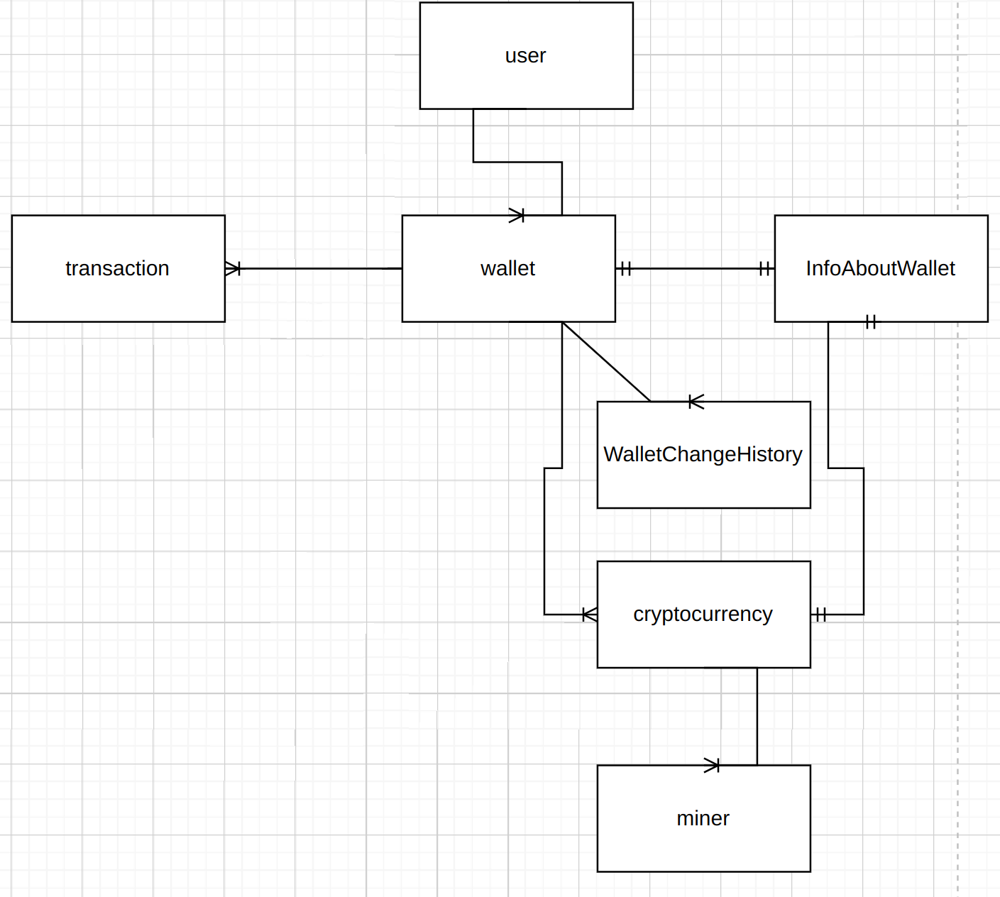
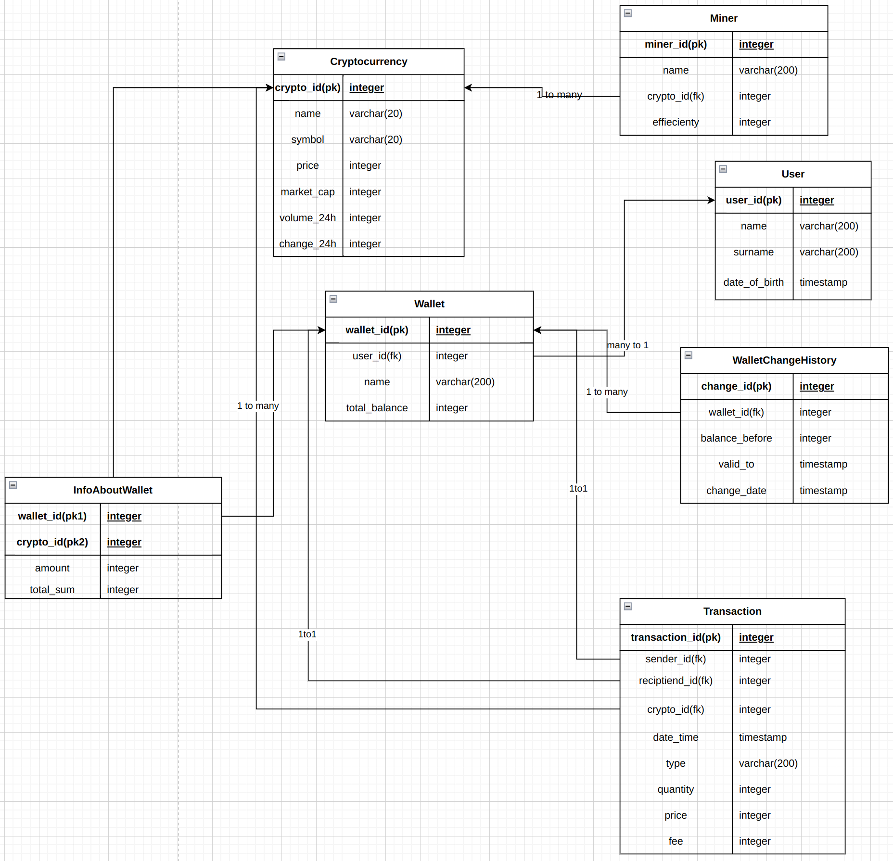

### Введение

##### ***Цель работы:***
  *Получение практических навыков работы с промышленными СУБД, проектирование
БД (концептуальное, логическое, физическое), создание хранимых процедур, представлений,
триггеров, индексов. Попрактиковаться в тестировании запросов (DQ — Data Quality).*

-------
#### ***Инструменты***:
 PostgreSQL 15, Python 3.8+, Gitlab CI.

--------
 #### ***Описание проекта:***

* Проект будет по теме криптовалют и блокчейн-технологий. Цель работы заключается в построении базы данных o криптовалютах и блокчейн-технологиях.

----------

#### ***Предметная область и сущности:***

Сущности:

*    1. Криптовалюта - информация о конкретной криптовалюте, включая название, символ, курс, рыночную капитализацию, объемы торгов, историю изменения       
        курса и другие свойства.

*    2. Транзакции - информация о транзакциях, проведенных с криптовалютой, включая дату и время, 
        тип транзакции (покупка/продажа/перевод и т.д.), количество и стоимость криптовалюты, комиссию и другие параметры.

*    3. Пользователи - краткая информация о пользователях.

*    4. Кошельки - информация о криптовалютных кошельках, включая тип кошелька, название, адреса, привязанные к нему и суммарный баланс.

*    5. Майнеры - информация о майнерах, включая тип оборудования, скорость майнинга, энергопотребление, прибыльность и другие характеристики.

*    6. Изменение кошелька - для того, чтобы таблица кошельков была версионной, добавим новую сущность истории изменений, где будем записывать историю        изменений кошелька.

*    7. Информация о кошельке - так как на одном кошельке можно хранить несколько криптовалют, добавим сущность, которая будет связывать сущности "Кошелек" и "Криптовалюта"

-------

### ***Подробное описание каждой сущности и их назначения в БД***

1. * Криптовалюта - это основная сущность, которая будет содержать информацию о каждой конкретной криптовалюте. Атрибуты таблицы включают:
        * id - уникальный идентификатор криптовалюты
        * name - название криптовалюты
        * symbol - символ криптовалюты
        * price - текущая цена криптовалюты
        * market_cap - рыночная капитализация криптовалюты
        * volume_24h - объем торгов за последние 24 часа
        * change_24h - изменение курса криптовалюты за последние 24 часа

------

2. * Транзакция - это сущность, которая будет содержать информацию о всех проведенных транзакциях с криптовалютой. Атрибуты таблицы включают:
        * id - уникальный идентификатор транзакции
        * sender_id - идентификатор кошелька отправителя транзакции (ссылка на таблицу Пользователи)
        * recipient_id - идентификатор кошелька получателя транзакции (ссылка на таблицу Пользователи)
        * cryptocurrency_id - ссылка на криптовалюту, с которой была проведена транзакция
        * date_time - дата и время проведения транзакции
        * type - тип транзакции (покупка/продажа/перевод и т.д.)
        * quantity - количество криптовалюты, участвующей в транзакции
        * price - стоимость транзакции
        * fee - комиссия, взимаемая за проведение транзакции

-------

3. * Кошелек - это сущность, которая будет содержать информацию о криптовалютных кошельках. Атрибуты таблицы включают:
        * id - уникальный идентификатор кошелька
        * owner_id - id хозяина кошелька
        * name - название кошелька
        * total_balance - суммарный баланс кошелька

--------

4. * Майнер - это сущность, которая будет содержать информацию о майнерах. Атрибуты таблицы включают:
        * id - уникальный идентификатор майнера
        * name - название майнера
        * cryptocurrency_id - ссылка на криптовалюту, которую майнер добывает
        * efficiency - эффективность майнера
-----
5. * Пользователь - это сущность, которая будет содержать информацию о пользователе. Атрибуты таблицы включают:
        * id - уникальный идентификатор пользователя
        * name - имя пользователя
-------
6. * История изменений кошелька - сущность для отслеживания изменений кошелька:
        * id - уникальный идентификатор записи
        * wallet_id - идентификатор кошелька
        * balance_before - баланс до изменения
        * change_date - дата изменения
        * valid_to - дата валидности записи
-----
7. * Информация о кошельке - связующая сущность между криптовалютами и кощельком
        * wallet_id - уникальный идентификатор кошелька
        * crypto_id - уникальный идентификатор криптовалюты
        * amount - ее количество
        * total_sum - сумма по этой валюте
------ 

### ***Цель проекта:***

 *    Cоздать базу данных для хранения информации о криптовалютах, транзакциях, адресах, кошельках и майнерах с целью анализа криптовалютного рынка и принятия инвестиционных решений. Данная база данных позволит отслеживать изменения цены криптовалют, объема торгов, анализировать транзакции и движение средств, а также отслеживать производительность майнеров и эффективность их работы. Все это может быть полезной информацией для трейдеров, инвесторов и аналитиков криптовалютного рынка

 ### ***Актуальность области***

*    Область криптовалют и блокчейна актуальна, так как они представляют собой новый тип цифровых активов, который может использоваться для хранения и передачи ценностей без необходимости привлечения посредников. Блокчейн, в свою очередь, обеспечивает безопасность и прозрачность транзакций, что делает его привлекательным для различных отраслей, таких как финансы, логистика, здравоохранение и другие. Кроме того, криптовалюты и блокчейн являются быстро развивающимися технологиями, что делает их важным объектом исследования и анализа.

# ***Концептуальная модель***

# ***Логическая модель***

